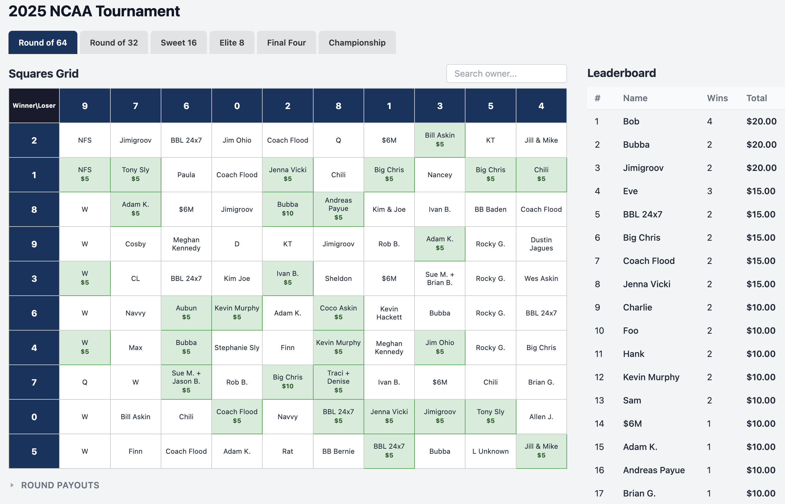
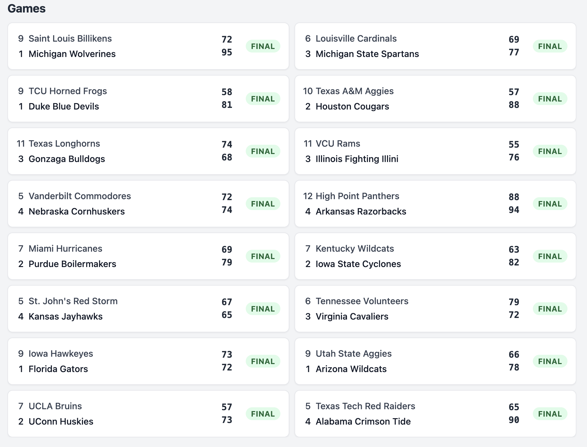
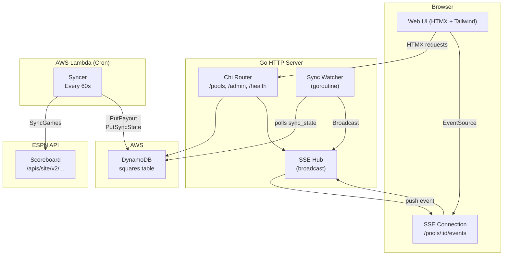
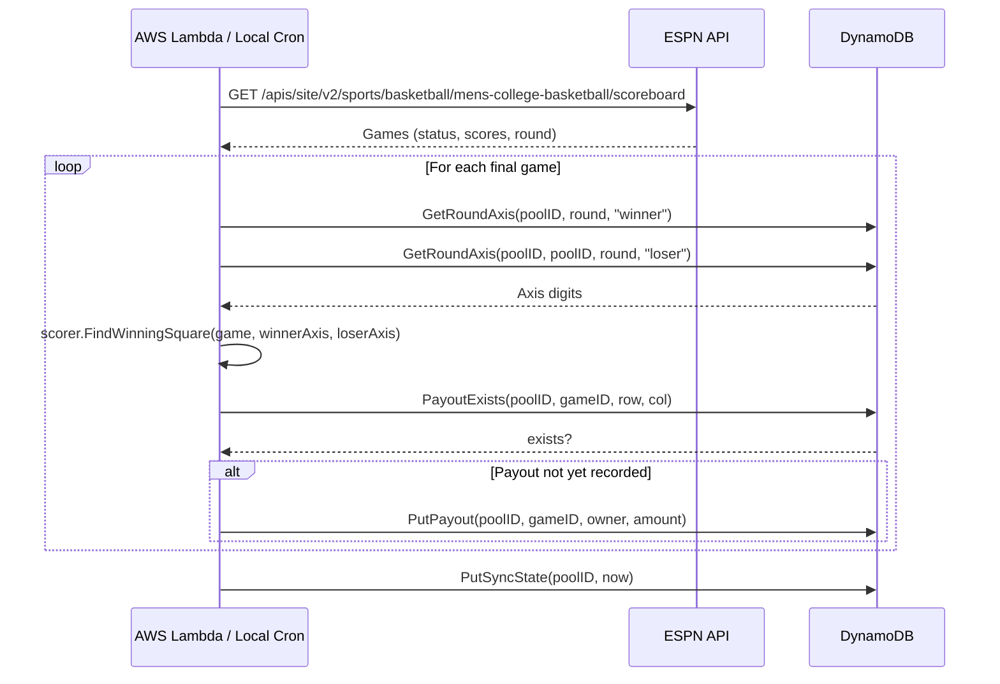
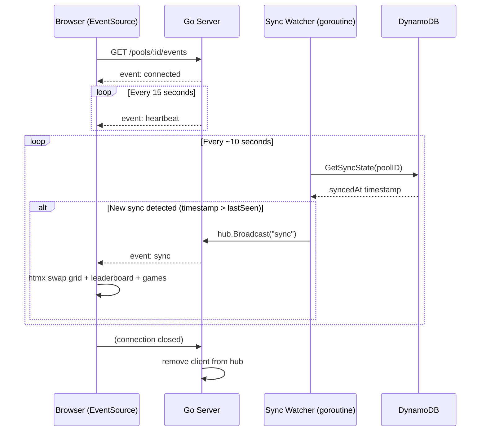

# NCAA Tournament Squares

A real-time web app for running a "squares" pool during the NCAA Basketball Tournament. Track live scores, see who's winning, and celebrate payouts — all without everyone needing to be in the same room.

---

## Why This Exists

I bought some squares in my friend's office pool for this year's NCAA Tournament. The catch: most of the participants are remote and rarely see each other. After a game ended there was always a lag — someone had to manually check the scores, figure out which square won, post in the group chat, and hope everyone saw it.

So I built this.

**Squares** gives organizers and participants a single place to:

- See the board with all squares and their owners
- Watch live scores update in real time (no refresh needed)
- Know instantly which square won a game and how much the payout is
- Track who's leading the pool across all rounds of the tournament

It's designed for the organizer to set up once and share the URL. From there, the app handles everything — syncing ESPN scores on a schedule, computing winning squares, updating the leaderboard — all automatically.

---

## Screenshots

### The Board



The main 10×10 grid showing every square, its owner, and winning squares highlighted. Axes shuffle per round so every game is fair.

### Live Game Updates



Live game scores pulled from ESPN. The page auto-updates via Server-Sent Events — no polling, no refresh. When a game goes final, the winning square and payout are computed and surfaced immediately.

---

## How It Works

1. **Create a pool** — set a name and per-round payout amounts
2. **Assign squares** — give each of the 100 cells an owner's name
3. **Set axes** — row/column digits (0–9) are randomly shuffled per round
4. **Share the URL** — participants open the app and watch
5. **Sync runs automatically** — a cron job hits the ESPN API, finds final games, computes winning squares, and writes payouts to DynamoDB
6. **The board updates live** — the server detects new syncs via a DynamoDB poll and pushes a Server-Sent Event to all connected browsers

---

## Architecture



### Cron Syncer — Sequence Diagram



### SSE Watcher — Sequence Diagram



---

## Requirements

- Go 1.21+
- AWS credentials configured (for DynamoDB)
- DynamoDB table named `squares` with `PK` (String) and `SK` (String) keys

---

## Environment Variables

| Variable          | Default     | Description                                           |
|-------------------|-------------|-------------------------------------------------------|
| `DYNAMODB_TABLE`  | `squares`   | DynamoDB table name                                   |
| `AWS_REGION`      | `us-east-1` | AWS region                                            |
| `PORT`            | `8080`      | HTTP server port                                      |
| `POOL_ID`         | `main`      | Pool identifier                                       |
| `ADMIN_TOKEN`     | _(none)_    | Token required to access `/admin`                     |
| `SYNC_INTERVAL`   | `60s`       | Cron sync interval (local mode only)                  |
| `SERVER_URL`      | _(none)_    | Local mode: notify server after sync (optional)       |

---

## Running Locally

```bash
# Seed the database with sample data
make seed

# Start the server
make run

# Run a one-shot score sync
make sync
```

## Building for Lambda

```bash
make build
# Produces a `bootstrap` binary for Lambda (linux/arm64)
```

---

## Deployment

The app runs as two separate components:

- **Server** — Go HTTP server behind an AWS ALB, containerized via Docker
- **Cron** — Go Lambda function triggered on a schedule (EventBridge) to sync ESPN scores

Both read/write the same DynamoDB table. The Lambda writes a `sync_state` record after each sync; the server's background watcher goroutine polls that record and fires SSE broadcasts to all connected browsers when new data arrives. This decoupling means the Lambda never needs to call the server directly.

Infrastructure is defined in the `infrastructure/` directory (Terraform/CDK).

> **License:** Non-commercial use only. See [LICENSE](LICENSE).
